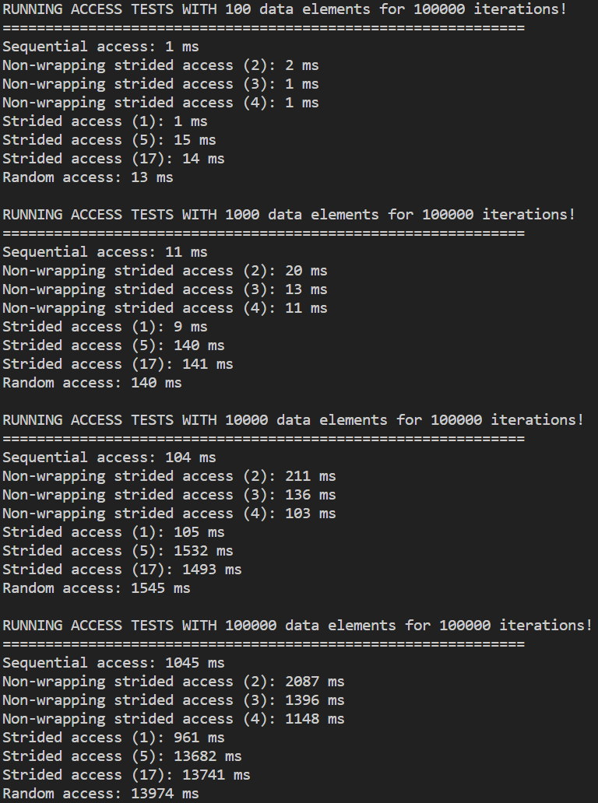

# Soft Memory Hierarchies
Memory hierarchies are at the core of almost everything in programming. We'll take a look at memory hierarchies
in hardware, how you can exploit awareness of memory hierarchies to improve performance and energy efficiency,
and how common data constructs relate to the memory hierarchies.

<figure markdown>
{ width="600" }
<figcaption>
Memory hierarchy of the AMD Athlon.
<a href="https://en.wikipedia.org/wiki/File:Hwloc.png">
Image credit </a>
</figcaption>
</figure>

As mentioned in the module intro, the CPU's memory hierarchy is represented by a series of hardware components
with different sizes and speeds. But don't fret, memory hierarchies and their hardware design subtleties won't
be the primary focus of this module. This section will focus on the various programming constructs to better
use the memory hierarchy. First we will start bridging hardware and software.

## Getting to the Point(er)
One of the core mechanisms in using memory is the notorious pointer. All it does is point to pieces of memory.
Why? Because a pointer is basically just an address. Anti-climactic, I know, but as one of the core building
blocks of computing, we need to really examine these concepts from the bottom up.
If you have ever tried programming in C, you will invariably have been introduced to the pointer.
The examples in this heading will be in C, but don't worry, we won't even define an entire function.
Pointers are rife with opportunities for getting into trouble, to a degree where in Rust, which is made to be a
reasonably safe language, you can't directly interact with a pointer unless you have an unsafe region
around the pointer interaction. Yikes! On the other hand, you can get some of the most extreme performance
by using raw pointers. So let's take a look!

### Allocation
First of all, how do we get a pointer? Please note that checks for whether we have been given a valid pointer
have been omitted. In the example below we get a pointer to a piece of memory which can hold up to 42 elements.

=== "C"

    ```c
    int element_count = 42;
    int* integer_array;
    integer_array = malloc(element_count * sizeof(int));
    ```

Let's break it down!

=== "C"

    ```c
    int element_count = 42;
    ```

We assign the number of elements to a variable in order to not have magic numbers.

=== "C"

    ```c
    int* integer_array;
    ```

This is actually bad practice. We have an uninitialized variable here. We could try and dereference the pointer,
more on that in just a second, and try to access memory which we either don't have the right to access
or which doesn't exist. The pointer at this point is likely to either be 0 or complete garbage.
```int*``` reads as "a pointer to integers" or "address of one or more integers".

=== "C"

    ```c
    integer_array = malloc(element_count * sizeof(int));
    ```

We ask for a memory allocation ([malloc][0]) from the
operating system. What we get back is just a runtime dependent address.
The address itself is what is known as a [word][1].
The size of the word dictates how much memory you can address in a system. If you have a 32-bit, 4 bytes, word
and you use byte addressing, meaning one byte for every address, we can at most address 2GB of memory with a
single word. If we have 64-bit words we can address more memory than we could possibly get. When you
see something is a 32-bit or 64-bit operating system, this is why! It is also why we all of a sudden started
using more than 2GB of RAM per computer in the 2000's.
The address given by ```malloc``` will be different every time you run your code.
Usually, any call to the operating system will be a very slow operation and should happen as little as possible.
This can be stuff like writing to a terminal, accessing a file on disk, and so on.
What we give malloc as an argument is the number of BYTES, as in 8-bits per element, we want.
We want ```element_count``` elements which should each have a size of 32-bits (4 bytes).
```sizeof(int)``` returns 4. In total we ask for 168 bytes. ```malloc``` itself returns ```void*```.
Since C allows for implicit casting, what happens is that C, without us asking,
changes the type to ```int*```. Underlying it is the exact same thing.
It is an address where 168 bytes allocated for us begins. What changes from ```void*``` to ```int*``` is
how we dereference the pointer and what happens when we do.

### Dereferencing
A pointer is a reference to another place in memory. Quite literally it is just a number.
Dereferencing is a term for following the address to what it points to.

=== "C"

    ```c
    int element_count = 42;
    int* integer_array;
    integer_array = malloc(element_count * sizeof(int));

    *integer_array = 0;
    *(integer_array + 1) = 1;
    integer_array[2] = 2;
    integer_array = integer_array + 3;
    *integer_array = 3;
    ```

In this example there's three different ways of dereferencing shown.

=== "C"

    ```c
    *integer_array = 0;
    ```

In C, we use the ```*``` operator in front of the pointer to follow the address to the memory.
The base pointer we got from ```malloc``` is the address of the first of the 42 elements in our memory.
Another way of seeing it is that ```integer_array``` holds an address, let's say... 42. Our program
now asks the CPU to write to the address 42, the number 0. So far so good. But then this happens.

=== "C"

    ```c
    *(integer_array + 1) = 1;
    ```

This is one of the myriad reasons why we needed to have an ```int*```. If the address in ```integer_array``` is
42, to get the next integer element, we don't go to the address 43, which would just be the second byte of the
first element. No, we want to go to the address 46, where the second element in the array begins. Since
```integer_array``` has the type ```int*```, we have defined that each element is 4 bytes and we now have a
*stride* of 4 bytes.
We also need to keep track of the size of our allocation close to the pointer itself,
as trying to access an element outside of our allocation will be catastrophic, and likely result in a
[segmentation fault][2]. So, no ```integer_array[42]```.
Back to the line on hand. We put our ```integer_array``` in a parentheses to make sure the
dereferencing doesn't happen until after we have changed the address. So we increment the base pointer (42)
with a stride of 4 (46), and then dereference (*) to assign a value of 1 to the second element in our array.

=== "C"

    ```c
    integer_array[2] = 2;
    ```

A short hand for the previous line, is this line. ```integer_array[2]``` is shorthand
for ```*(integer_array + 2)```.

=== "C"

    ```c
    integer_array = integer_array + 3;
    *integer_array = 3;
    ```

With these lines we manipulate the base pointer itself, by reassigning a value of the base address (42),
incremented by 3 (54), before doing a simple dereferencing and assigning a value of 3. This is not a recommended
way of doing things. How do we ensure that we always have the pointer to the base address?
The least you can do is to copy the base pointer and increment that. Why?

=== "C"

    ```c
    int element_count = 42;
    int* base_integer_array = malloc(element_count * sizeof(int));

    *base_integer_array = 0;
    *(base_integer_array + 1) = 1;
    base_integer_array[2] = 2;

    int* integer_array = base_integer_array + 3;
    *integer_array = 3;
    integer_array[1] = 4;
    ```

Because we need the address to give the memory back to the operating system.

### Deallocation
Once we are done with the section of memory we have so graciously been granted by the operating system,
we should remember to return it to the operating system. If we don't we might get a memory leak,
which is when our program uses more and more memory until the program is stopped or crashes.
The operating system might keep track of the memory though and clean up once our less than stellar code terminates.

In C, we can return our memory like this, using the [free][3] function.

=== "C"

    ```c
    int element_count = 42;
    int* base_integer_array = malloc(element_count * sizeof(int));

    *base_integer_array = 0;
    *(base_integer_array + 1) = 1;
    base_integer_array[2] = 2;

    int* integer_array = base_integer_array + 3;
    *integer_array = 3;
    integer_array[1] = 4;

    free(integer_array);
    ```

Spot the error?

??? note "Answer"

    We had two pointers and forgot to ```free``` using the base pointer, ```base_integer_array```.
    This is [undefined behavior][https://en.wikipedia.org/wiki/Undefined_behavior], which means
    that there are literally no definitions of what will happen. It is really bad. What we
    should have done was this -

    === "C"
        ```c
        int element_count = 42;
        int* base_integer_array = malloc(element_count * sizeof(int));

        *base_integer_array = 0;
        *(base_integer_array + 1) = 1;
        base_integer_array[2] = 2;

        int* integer_array = base_integer_array + 3;
        *integer_array = 3;
        integer_array[1] = 4;

        free(base_integer_array);
        ```

Note that ```free``` takes a ```void*```. Our ```int*``` is cast, without us asking explicitly, to a ```void*```.
The operating system just wants an address. This allows the operating system to mark the section,
denoted by the start of the section, and probably by its own record of the length.
Note also that the address (42) held by ```base_integer_array``` is still in play.
It is what is known as a 'dangling pointer'.
We could try to dereference it after giving it to ```free```, which is the notorious ```use after free```.
This is also undefined behavior as we try to access memory that is no longer accessible by our program.
What we could do is to set ```base_integer_array``` and ```integer_array``` to new values to denote
that they were invalid.

=== "C"

    ```c
    int element_count = 42;
    int* base_integer_array = malloc(element_count * sizeof(int));

    *base_integer_array = 0;
    *(base_integer_array + 1) = 1;
    base_integer_array[2] = 2;

    int* integer_array = base_integer_array + 3;
    *integer_array = 3;
    integer_array[1] = 4;

    free(base_integer_array);
    base_integer_array = NULL;
    integer_array = NULL;
    ```

This does not however, stop us from trying to dereference those pointers, but it does allow for a more
general check to see whether the pointers are still valid.

=== "C"

    ```c
    if (base_integer_array != NULL){
        free(base_integer_array);
    }
    ```

If this all seems a bit scary, that's because it is. Anytime a system depends on humans just not
making any errors and being rockstars at everything, it's a dangerous system and you should be on guard.

## Access Patterns
While it is import that you increase your understanding of what it takes to get valid,
predictable, boring code. Which is the best kind. What you are most likely interested in
is for you to write more performant code. An absolutely essential part of getting performant code is
how we access the underlying memory. Yes, we can address memory a single byte at a time with
[byte addressing][5]. But, whenever we ask for a byte, the memory is transported as a cache line
through the memory hierarchy. As in, the L3, L2 and L1 cache all receive an entire cache line.
That cache line is usually 64 bytes.

What is in the cache line is dictated by [cache line alignment][6]. If for example you had made a
struct (it's like an object, but just the data) like the one below and you elected to turn off the
auto-alignment with ```__attribute__ ((packed))```

=== "C"

    ```c
    struct __attribute__ ((packed)) my_struct
    { 
        short first; // 2 bytes 
        int second; // 4 bytes
    }
    ```

and you allocated an array of ```my_struct``` like so

=== "C"

    ```c
    int element_count = 4;
    my_struct* structs = malloc(element_count * sizeof(my_struct)); // 4 * 6
    structs[1].first = 0;
    structs[1].second = 0;
    ```

If you had an alignment of say, 8 bytes, the last two lines would result in two cache lines being retrieved.

<figure markdown>
{ width="600" }
<figcaption>
Bad cache alignment.
</figcaption>
</figure>

Which is not good. What we could do instead would be to pad our struct a little bit, which is the default
behavior in C, up to some amount of alignment.

=== "C"

    ```c
    struct my_struct
    { 
        short first; // 2 bytes 
        short _pad; // 2 bytes
        // Usually in C it will fix this automatically, padding
        // every element to a multiple of a value. This could for example
        // be 4 bytes.
        int second; // 4 bytes
    }

    int element_count = 4;
    my_struct* structs = malloc(element_count * sizeof(my_struct)); // 4 * 8
    structs[1].first = 0;
    structs[1].second = 0;
    ```

Then our alignment becomes this -

<figure markdown>
{ width="600" }
<figcaption>
Better cache alignment.
</figcaption>
</figure>

and we now only involve a single cache line. Which is quite a bit smaller than the more standard 64 byte
cache line.

Now that we have learned a bit about cache lines, we are equipped to actually talk about access patterns.
I have made some Rust code for you, which is located at ```m1_memory_hierarchies::code::access_patterns``` or
[online][7].

First off is sequential access. It is the one we usually strive for. We start at one end and go through every
element until the end, from index 0 to the end. If everything is cache aligned, great! If not, the cost of
not being aligned will probably be as low as it can be, when we aren't reusing any retrieved elements. If a
value, say a 4-byte integer, is spread across two cache lines, that specific value may have to be reconstructed
which can be expensive.

Next up is strided access. With strided access we only read every N elements. Based on the size of the stride
and the size of the elements, it might result in each cache line only being used for a single element.
In the code there is both a non-wrapping and a wrapping stride implementation. Once the wrapping stride steps over
the end it wraps back around using a modulo operator. This is to ensure that it accesses the same amount
of elements as the sequential access. With the non-wrapping stride we only access every N elements,
but we also end up doing much less work.

Finally, we have random access. This is basically the worst case scenario. We randomly select an element
to access the same amount of times as the number of elements in the array. This random access
is based on sending what would otherwise have been the access index through a hash function which
hopefully results in a reasonably random access distribution. In the first version I got random accesses
through a random number generator. It turned out to be overkill and resulted in extremely poor
performance for random access. Your take away from that should be that generating random floats
is very expensive.

<figure markdown>
{ width="400" }
<figcaption>
Timing access patterns in Rust.
</figcaption>
</figure>

Given that we just talked about cache lines, most of these numbers make good sense.
Wrapping strided access is bad. Random access is the same as the worst (17) wrapping strided access.
Why do you think that is?

??? Note "Answer"

    My best guess is that once you are that far outside of being able to reuse a cache line, essentially
    every single access will be a cache miss, it's effectively the same.

Most interestingly non-wrapping strided access, which actually accesses less elements than the others,
is slower than sequential access for strides 2 and 3. With stride 4, where we are
only accessing one fourth the elements of the sequential access pattern, we begin to
get faster. But what do you know, sometimes the nice and predictable path,
which might seem like we are doing more work actually runs faster. What a time to be alive!

## Stacking Heaps of Trouble
If you aren't familiar with the [stack and queue][8] data structure types, this would be a good time to
follow the link and familiarize yourself.

The stack is not just a data structure, but also a core part of how all of the variables
in your local scope are kept track of when the program enters into a function. The stack
is a designated part of the memory allocated to your program. It starts at size 0.
Once you enter a function, each local variable is pushed unto the stack. The stack
generally requires that sizes are known at compile time. Once you call a function
from within your function, the local variables are no longer accessible to the function
you just entered, but once you return from that function, they are.
When you enter that function, a pointer to where you called the function from is added
to the stack and that function has its own local variables.

<figure markdown>
{ width="500" }
<figcaption>
The call stack.
<a href="https://en.wikipedia.org/wiki/Stack-based_memory_allocation">
Image credit </a>
</figcaption>
</figure>

If you push enough of these frames unto the stack, you can get a stack overflow.
This can for example happen if you write a recursive program that doesn't terminate.
In general, using variables from the stack will be faster than using variables
from the heap. But we also can't return pointers to a stack variable as it might disappear
or be overwritten at any moment.

The heap, in this context, is not the actual data structure known as a heap.
Instead it is a bunch of unstructured memory living in the [same reserved space][9] as the stack.

<figure markdown>
{ width="500" }
<figcaption>
The stack and the heap sharing memory.
<a href="https://courses.grainger.illinois.edu/cs225/fa2021/resources/stack-heap/">
Image credit </a>
</figcaption>
</figure>

Thus if either one becomes too big they begin encroaching on the other's space. Everytime you ask for
dynamically sized memory, it is allocated on the heap. This is a slow process and you have to remember
to deallocate the memory to not get a memory leak. But the memory survives across functions. If you remember
the pointer examples from earlier - the memory segment we asked for lived on the heap, whereas the
pointer (address) itself lived on the stack. We are allowed to keep the pointer on the stack because
a pointer is a known size at compile time. We can also have arrays on the stack, but they generally need
to have a size known at compile time. Moving a pointer from place to place, is also a lot cheaper than
copying every single element of a large array every time ownership changes hands.

## Additional Reading
An explanation of memory allocation, stack and heap [in C][10].

A more rigorous [explanation][11] of the register, cache, main memory and virtual memory parts of
the memory hierarchy.

Check out the memory and cache specs for Apple's [M1 series][12].

[0]: https://en.cppreference.com/w/c/memory/malloc
[1]: https://en.wikipedia.org/wiki/Word_(computer_architecture)
[2]: https://en.wikipedia.org/wiki/Segmentation_fault
[3]: https://en.cppreference.com/w/c/memory/free
[5]: https://en.wikipedia.org/wiki/Byte_addressing
[6]: https://en.algorithmica.org/hpc/cpu-cache/alignment/
[7]: https://github.com/absorensen/the-guide/tree/main/m1_memory_hierarchies/code/access_patterns
[8]: https://en.wikibooks.org/wiki/Data_Structures/Stacks_and_Queues
[9]: https://courses.grainger.illinois.edu/cs225/fa2021/resources/stack-heap/
[10]: https://cs2461-2020.github.io/lectures/dynamic.pdf
[11]: http://eceweb.ucsd.edu/~gert/ece30/CN5.pdf
[12]: https://en.wikipedia.org/wiki/Apple_M1
