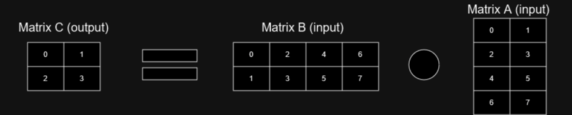
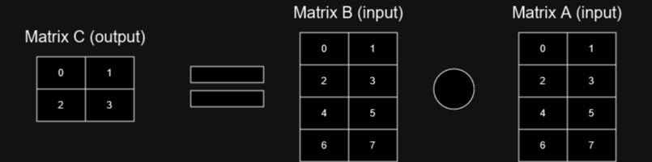

# Less Basic Data Structures
In this section, things will start getting a spicier and more experimental. We'll look at concepts
like smart pointers, which can keep track of deallocating memory for us, how to play around with
vectors and matrices, how hash maps (dictiornaries) are implemented, graph- and tree structures,
garbage collectors (which you need graphs and smart pointers to understand), and virtualized memory,
which is when you build your own memory abstractions.

## Smart pointers
Ok, so I promised previously, that I would explain how Python, and most other garbage collected languages,
deal with assigning one variable to another. If you recall the previous example -

=== "Python"

    ```python
    x = [5, 5, 3, 42]
    y = x
    ```

We start by making a list and assigning a reference to ```x```. In this case ```x``` is not the actual owner
of the list. Instead, the system takes ownership of the list, and ```x``` is a live reference to that list.
The system keeps track of how many live references there are to the list. Once ```x``` goes out of scope,
the live reference count for the list decreases by one. Once the live reference count reaches 0, it is
deallocated or marked available for future deallocation.

Until we hit the end of the scope, and ```x``` and ```y``` disappear, there are two live references to the
list created at line 1. While a fine enough solution at first glance, sometimes, answering the question
"what is alive" can be quite difficult. More on that in the [garbage collector section][0].

When dealing with raw pointers, like we saw earlier, once a system grows beyond absolute simplicity,
sharing multiple pointers to the same object becomes a bit complex. If you have 5 pointers to the same
object floating about how do you ensure it isn't used after freeing? Who deallocates the pointer and who
ensures that the pointers are no longer valid? This at the absolute crux of safety and your program not
blowing up in C and C++.

In C++11+ and Rust, we can elect to use something called smart pointers. Which can handle some of the
intricacies for us. First off there is the [unique_ptr<T>][1], as in C++, or the [Box<T>][2] in Rust.
I will just refer to ```Box``` from here on out, their behaviors seem to be more or less the same.
```Box<T>``` is like a ```T *``` in C (pointer to object of type T). With two notable exceptions. It cannot
be copied. As in, you cannot have multiple instances of ```Box``` pointing to the same underlying object.
Thus ```Box``` in Rust, as well as in C++, requires that ownership is moved, and not copied.
The other notable difference from a raw pointer is that once the ´´´Box´´´ goes out of scope,
the object on the heap that it is pointing to is deallocated automatically.  

=== "Rust"

    ```rust
    let box_variable: Box<i32> = Box::new(42);
    let mut other_box: Box<i32> = box_variable; // box_variable no longer accesible due to move
    let copied_variable: i32 = *other_box; // Dereference and copy the underlying value, this is not a move
    *other_box += 1;
    println!("{}", copied_variable); // prints 42
    println!("{}", *other_box); // prints 43
    ```

Next up are the shared pointers. They are essentially what Python is using in the example from earlier. In C++
it is called [shared_ptr<T>][3], in Rust it comes in two versions; [Rc<T>][4] and [Arc<T>][5]. ```Rc```
stands for reference counted. It is only made for single threaded usage as the reference count itself is
susceptible to a data race, which you may recall, is several reads and/or writes to the same value.
This could result in the count of live references being incorrect and the underlying value never being deallocated.

=== "Rust"

    ```rust
    use std::rc::Rc;
    fn main() {
        let shared_reference_a: Rc<i32> = Rc::new(42); // Live references = 1
        println!("{}", Rc::strong_count(&shared_reference_a)); // prints 1

        let shared_reference_b: Rc<i32> = shared_reference_a.clone(); // Live references = 2
        println!("{}", Rc::strong_count(&shared_reference_b)); // prints 2

        {
            let shared_reference_c: Rc<i32> = shared_reference_a.clone(); // Live references = 3
            let shared_reference_d: Rc<i32> = shared_reference_b.clone(); // Live references = 4
            
            println!("{}", *shared_reference_c); // prints 42
            println!("{}", Rc::strong_count(&shared_reference_a)); // prints 4

            println!("{}", *shared_reference_d); // prints 42
            println!("{}", Rc::strong_count(&shared_reference_d)); // prints 4

        }
            // shared_reference_c and shared_reference_d are now dropped
            println!("{}", Rc::strong_count(&shared_reference_b)); // prints 2

            // Live references = 2
            println!("{}", *shared_reference_a); // prints 42
            println!("{}", *shared_reference_b); // prints 42
    }
    ```

```Arc<T>``` is here to solve exactly that issue. It uses atomic reference counting.
Atomics will be introduced in the [concurrency][6] module. But in this context, it means that the
reference counting is thread-safe, but a bit slower.

=== "Rust"

    ```rust
    use std::sync::Arc;

    fn main() {
    let shared_reference_a: Arc<i32> = Arc::new(42); // Live references = 1
    let shared_reference_b: Arc<i32> = shared_reference_a.clone(); // Live references = 2

    {
        let shared_reference_c: Arc<i32> = shared_reference_a.clone(); // Live references = 3
        let shared_reference_d: Arc<i32> = shared_reference_b.clone(); // Live references = 4
        
        println!("{}", *shared_reference_c); // prints 42
        println!("{}", *shared_reference_d); // prints 42
    }
        // shared_reference_c and shared_reference_d are now dropped

        // Live references = 2
        println!("{}", *shared_reference_a); // prints 42
        println!("{}", *shared_reference_b); // prints 42

    }
    ```

While ```shared_ptr``` from C++ allows you to mutate the value it refers to ```Rc``` and ```Arc``` do not.
They require a synchronization primitive wrapped around your underlying value, like ```Arc<RwLock<i32>>```,
but that is more advanced usage, and don't worry about it right now. Other than the atomicity, and being
shareable between threads, ```Rc``` and ```Arc``` work more or less the same.

Finally, we have the weak pointer. This basically exists to weaken cyclical references. If object A refers
to another object, object B, with an ```Rc```, while the object B refers to object A, we have a problem.
When either, or both go out of scope, they will not be deallocated as there is live references to both.

Try to take a second and imagine this and the things that can go wrong
when there are multiple references interconnected.

Go on.

I will wait.

To solve this issue, the weak pointer comes to the rescue. It is along for the party, but doesn't actually
keep things alive. In Rust it is called [Weak<T>][7]. It can reference the same underlying object as the
shared pointer it comes from, but does not contribute to the live reference count. As such, it can allow
you to have cyclical references, without causing a memory leak. If object A points to object B with an
```Rc``` reference, but object B points to object A with a ```Weak```, once object A goes out of scope,
both object A and object B can safely be deallocated.

=== "Rust"

    ```rust
    use std::rc::Rc;
    use std::rc::Weak;

    fn main() {
        let shared_reference: Rc<i32> = Rc::new(42); // Live references = 1
        let weak_reference: Weak<i32> = Weak::new(42); // Create a weak reference from nothing
        let weak_shared_reference: Weak<i32> = Rc::downgrade(&shared_reference);

        println!("{}", Rc::weak_count(&shared_reference)); // prints 1!
    }
    ```

For more information on smart pointers in Rust, there is a nice example [here][8] and another example
about [reference cycles][9], which is what we needed weak pointers for.

## The Vector Reloaded
This isn't meant to be a one-to-one representation of how tensors work in ```numpy``` or ```PyTorch```,
but combined with creating different views on the same underlying one dimensional memory as we learned
about earlier, we can look at a few other fun concepts in different ways to arrange tensors.

### Strided Access and Transposition
One of the most used operations is the matrix multiplication. If we assume two 2D matrices as input and
output into another 2D matrix, one of those input matrices will be accessed with a strided access in
a column major form.

<figure markdown>
{ width="500" }
<figcaption>
Matrix multiplication. The numbers indicate access order.
</figcaption>
</figure>

There is a solution for this. We can just transpose the second input matrix. Transposition, as you might remember,
is flipping a matrix around the diagonal. Another way to do this is to flip all coordinates. (0, 0) becomes
(0, 0), but (3, 1) becomes (1, 3). Transposition is an expensive operation however, and we have to create
additional code for whether the second input matrix is transposed and the other multiplication code for just
that case. We also need to keep track of which matrices are transposed. In a more general, flexible system,
or one in which the system does a lot of optimization without user input, we also need to evaluate when and
where to tranpose matrices. But, if the matrix is fairly static and is read from often, it can definitely be
worth the time and effort.

<figure markdown>
{ width="500" }
<figcaption>
Matrix multiplication with the second matrix transposed.
</figcaption>
</figure>

Now, lets try out a simple example! Checkout the code at
```m1_memory_hierarchies::code::strided_access_and_transposition``` or check it out [online][10].

Interestingly, when running the code there doesn't seem to be much of a difference until
the matrix sizes become quite big. Why do you think that is?

<figure markdown>
{ width="500" }
<figcaption>
Difference gets bigger as the matrices get bigger.
</figcaption>
</figure>

One guess would be a combination of the compiler aggresively optimizing the code, the branch prediction of the
pipeline (don't worry about it) being really good at guessing these very uniform workloads, but most importantly,
the caches doing a lot of the heavy lifting for us. Once the caches run out of space we begin to see a gap
between the two ways of doing it. This might be more pronounced on the GPU. In most cases you should probably
start with making the simplest and easy comprehendable code and try out, and measure, potential
optimizations before spending your time going down rabbit holes. This is will be a bit of a theme
in the next few sections. There won't be much of a difference between techniques until the caches
begin running out of space.
At least if you aren't coding something really terrible, like randomized access.

### Permuted Arrays
Sometimes we might want to change around elements in a matrix, without permanently executing
the change. Not permanently executing these changes may also allow for several different
views of the same data. So let's take a look at how permutations work.

In the example below, the permutation is kept track of with the data in one vector and
the index changes in another. The second of the two indices we need to map from one
index to another is implicit. Thus for our permutation vector, index 0, means that
at index 0 in our new permuted array resides at index 4 in our original data.

This is likely to be quite a bit slower compared to normal sequential access as we now
have to follow more than one pointer to get to our data.

<figure markdown>
{ width="500" }
<figcaption>
Create permutations of an array by creating a list of indices and permuting that list.
</figcaption>
</figure>

If we only view the data through the lens of a single permutation array anyway and we
read from this vector alot, we might as well execute the permutation. If we
wanted to be able to undo the permutation, we could just keep track of the
permutation we executed and undo it later. But we should now be able to get back
to sequential access performance.

<figure markdown>
{ width="500" }
<figcaption>
If reading a lot from the same array with the same permutations, go ahead and execute the permutations.
</figcaption>
</figure>

There is a middle ground however, which is if we are just permuting rows. As long as the rows are long,
we should be able to get partially sequential access, at least if we are moving through the elements in
order.

<figure markdown>
{ width="500" }
<figcaption>
Offset some of the cost of permutations, by just permuting rows.
</figcaption>
</figure>

Now, lets try out a simple example! Checkout the code at ```m1_memory_hierarchies::code::permuted_arrays```
or check it out [online][11]

<figure markdown>
{ width="500" }
<figcaption>
Huh, that's weird. There doesn't seem to be much of a difference.
</figcaption>
</figure>

It seems pretty much the same.

<figure markdown>
{ width="500" }
<figcaption>
The differences appear as the cache runs out of space with bigger data sizes.
</figcaption>
</figure>

Once we run out of cache however, the executed permutation is quite a bit faster.
Permuting just the rows can also give quite a performance boost.

### Jagged Arrays
A weird form of array is the jagged array. A 2D matrix can't simply be
expressed as having dimensions NxM, but Nx? or ?xM dimensions. As in N rows, each with their
own individual lengths, or M columns, each with individual lengths. It's a highly
flexible scheme, but unless you are absolutely sure you need it, you should absolutely avoid it.

In the example below, we attain this complete flexibility by using a vector of vectors,
which as you may recall is really bad for performance.

<figure markdown>
{ width="500" }
<figcaption>
Create a jagged array by using a vector of vectors.
</figcaption>
</figure>

If the difference between the smallest row and the largest row isn't too big,
we can sacrifice a bit of additional memory for allocating all rows as if they had
the same length and keep track of the length of the active sections in each row
in a separate vector.

<figure markdown>
{ width="500" }
<figcaption>
Slightly better now with the data in a single vector.
</figcaption>
</figure>

If we really wanted to compact the jagged array above, we could remove all of the
non-active segments (denoted -1) and use the auxiliary array to indicate where each
new row starts. Just like the first permutation scheme, we are dereferencing two pointers
for access.

Finally, we could do all of this, still under the constraint that we have a reasonable
ceiling on the max length of each row, by interleaving the auxiliary array with the data
array.

<figure markdown>
{ width="500" }
<figcaption>
All of the data in a single vector, with the blue values being the amount of active data in the row.
</figcaption>
</figure>

We can do this either compacted or non-compacted.

<figure markdown>
{ width="500" }
<figcaption>
All of the data in a single vector, with the blue values being the amount of active data in the row. Compacted data.
</figcaption>
</figure>

We've now removed what was a consistent implicit form. We no longer have random access to the row lengths.
We also now have to translate from whatever type is in the data array to valid integers for indexing.
If the data is integers, casting won't be much of a problem, but for floating point numbers we have to be
sure to get it right. If a number is not a whole number we are likely to have the number floored to the
nearest whole number.
Instead we have to go from row length to row length and find out how many indices we have to move forward to
get to the next indicator. As such, to get to the lower right corner element (42), we would first have to read
index 0, jump 4 spots forward to index 4, read the 4, jump 5 spots forward to index 9, and then jump forward
2 elements to get to what in a dense array would be index [2, 1].

This sort of makes me miss the auxiliary array. We can sum up the jumps to denote where each row starts.
This would allow for compaction of the data while keeping us to just two jumps. Note that we now keep track of
the length of each row by taking the difference between the starting index of the row we are looking to find
and the beginning of the next row. Which is also why I have inserted an extra starting index, which points
to the end of the array. Otherwise, we can't get the length of the last row.

<figure markdown>
{ width="500" }
<figcaption>
As we compacted the data, we can keep track of the starting index of each row in an auxiliary array.
</figcaption>
</figure>

Now for a simple performance benchmark. Checkout the code at ```m1_memory_hierarchies::code::jagged_arrays```
or check it out [online][12].

<figure markdown>
{ width="500" }
<figcaption>
Huh, that's weird. There doesn't seem to be much of a difference.
</figcaption>
</figure>

<figure markdown>
{ width="500" }
<figcaption>
There we go, we ran out of cache!.
</figcaption>
</figure>

Note that the only version which is not extremely slow for inserting values is the naive one. But in most other
cases our final optimized version JaggedArraySizeCompactedAux seems to be the winner. It doesn't take a lot of
memory compared to the other solutions and it seems to be in some cases on-par with the fastest
(with a reasonable variance) or the fastest. In most other cases the NaiveJaggedArray seems just fine.
Again, don't overcomplicate things and measure the differences for your case. In any case, you should
avoid a jagged array if you can. And especially the CompactedJaggedArray, which costs the least memory, but
has a catastrophic access time due to needing to accumulate the indices needed to find the row index. Plus,
having the indices be interleaved with the values is problematic as we mix control flow and data, as well
as needing to accomodate casting a data value to an index value. Please don't do that!

### Sparse Arrays
Finally, we have the sparse array. In the case of huge matrices with lots of values we don't care about,
especially 0's, we can use the run-length encoding we just saw to encode values. This usually results
in having to reconstruct where the indices are on the fly. The method below is ok for singular values,
such as a very large matrix with just diagonal values. If we have a band around the diagonal we could modify
the strategy from the last example in the jagged arrays section.  

<figure markdown>
{ width="500" }
<figcaption>
A sparse array created with run-length encoding. We could of course also just linearize the indices to get a single
number.
</figcaption>
</figure>

For this to be more efficient than the dense version, you usually need at least 90% sparseness, or an array
so big that you are having issues with memory. Sparse matrices also require their own separate implementations
and can be hard to parallelize.

## Hash Maps
Another fundamental data structure is the hash map. The hash map takes a key type and a value type.
The value type can pretty much be anything, don't worry about it! But where things get really interesting is
the key value. What a hash map does is to take a key value and translate it into an array index using something
called a hash function. A very simple hash function takes a number, adds a number, multiplies by a very big prime
number and then modulos that number by a number representing how much space we have available. The base
recommendation is that a hash map should have at least twice the space needed to densely represent the
same number of elements.

=== "Rust"

    ```rust
    // Not actually a good hash function
    fn example_hash_function(key: Vec<char>) -> usize {
        const PRIME: usize = 6457;
        let mut hash: usize = 0;
        for element in key {
            hash = ( (hash * 31) + key as usize ) ^ PRIME;
        }

        hash
    }
    ```

Generally, a hash map will have constant time lookup and insertion. The reason for the recommendation of
at least a factor 2 in space is collisions! A collision is when two different keys hash to the same
value in our storage. Remember that we can have both the initial key that we queried with, and the
post-hash key used for indexing into storage.
One way of resolving the collision is to keep searching our storage until we find an empty spot.
But then if we query our hash map and the first index we look at in storage, we iterate the
array until we find a key that matches the one we queried with. Much like vectors, the
hash map could dynamically expand to accomodate inserted data. Once we are done with insertions,
we might have a fragmented performance. If we know we are done and have a significant amount of
elements which need to be queried a lot, we can usually ask the data structure to
```.shrink_to_fit()``` or ```.rehash()```. Rehashing will reconstruct the structure to be
made as if it had only been the elements currently stored, all along.

<figure markdown>
{ width="500" }
<figcaption>
A number of keys have been inserted in random order. We try to find the entry corresponding to the key "Ni"
at index 3. But its natural spot was already taken by a spillover from the index 2. We find the entry
in the next index instead. This is also known as open addressing.
</figcaption>
</figure>

I will reiterate a theme here -
*if it can be done with a basic array, it should probably be done with a basic array*.
Of course there are different, more optimized methods for implementing hash maps, you can usually find a few
different ones based on the specific needs for your usage, i.e. if you need better insertion
performance or better read performance, but this is basically what you need to know.
In Rust it is ```HashMap<K, V>```, in C++ it is ```unordered_map<K, V>```, in
Python and C# it is called a dictionary. You can use anything for the key in Rust,
as long as the type implements the ```Hashable``` trait. You can even use strings.
This can be very useful for keeping an assortment of random data which you need to
distinguish between. For example, if you needed to keep track of different layers of a
neural network with random access, you can just create a new string "Linear0" and use
that as a key for the first linear layer and its contents, and then "ReLU0", "Linear1",
"ReLU1", "Softmax0" and so on. If possible, it is more efficient to use small types as
your key. Such as an integer.

Now for a simple performance benchmark. Checkout the code at ```m1_memory_hierarchies::code::hash_maps```
or check it out [online][13].

As you can see the hash map using integers clearly outperforms Strings. To be fair, every insertion in the
string based map, requires a clone of the original string, the read and update only requires a reference.
But we can expect just about a factor 2 performance difference by using the simpler type with the simpler
hashing function. It should however, be noted that the string keys were all just the integer keys
as strings, which might have an influence on the distribution in the hash table. What we could do
in our previous neural network layer example would be to have an integer value representing each layer type
and then the id. We could relegate them to different parts of an integer. This could for example be the first 20
bits reserved for the layer type and the last 44, or perhaps just 12, bits reserved for the layer id. This
does however incur a significant amount of extra code and the code will become more complex and implicit,
so it's probably only worth it if you are doing A LOT of accesses for each layer.

Generally, hash maps have an alright performance. C#'s dictionary lookup performance will usually go down
hill at around 30k entries though. This doesn't happen for arrays. You can read more about different hash table
implementations [here][14].

## Graphs and Trees
Now that we have dicked around with variations on a theme (that theme was arrays if you were in doubt),
let's look at a different fundamental data structure. Graphs! Not the kind with the lines...
wait these have lines too, uuuh, not the kind that has an x and a y axis, but the kind that has some circles with
some arrows between them. "But wait!" you say, "The heading says 'Graphs and Trees'" you say, well,
trees can be seen as a subset of graphs, while all graphs are not necessarily trees.

Graphs and trees are some of the absolutely fundamental data structures which you need to be acquainted with.
Along with arrays, queues, stacks and hash tables, they are the fundamental
building blocks with which you can make pretty much anything. Graphs and trees are a bit special, however, in them
being potentially easy to implement, but also very easy to mess up. Languages like C and C++ let you implement
them with relative ease, but implementing graphs and trees without cyclical references
(which can cause memory leaks), without data races, without dangling pointers and other robustness issues, is
actually quite hard. Sometimes even fundamentally unsafe.

I have used Rust as one of the primary languages for demonstrating and benchmarking things for you.
The examples under this header will be more along the lines of toy examples as Rust code for graphs
and trees can get quite hairy if you don't want to just sprinkle ```Arc``` everywhere. And even then you
might end up having to battle cyclical references.
It's really nice that the compiler puts on guard rails for you and herds you towards safe behavior.
Implementing graphs and trees in Rust is notoriously difficult for this exact reason.
Which is not to say that it is easier in C/C++, the compiler just doesn't stop you from doing
something problematic.

Anyways... the rest of the module will be about how using data structures like computational graphs,
which is essentially what is created when you define your entire neural network on a single object in
PyTorch, can speed up your code immensely as the structure allows the library/framework/compiler to reason
about your program. Essentially, computational graphs communicate the intention of your program ahead of time
before you start running everything in a loop. It can help the library/framework/compiler to optimize your code,
optimize where the data should be located, when the data should be moved to/from the GPU, when two operations
can be fused and so on.

Additionally, I will take a look at one of the simpler trees, the binary tree, and if you are interested in
graphics or computer vision, the octree is recommended reading.

### Graphs
Ok, so let's get this show on the road. Graphs are primarily made up of two things, nodes and edges.
Edges are references from one node to another. In a diagram they are usually represented by a line, some
times with one more arrows on the ends. Edges can be represented by indices, pointers, smart pointers or
something else that I can't think of right now. The node on the other hand, can be ✨ whatever you want ✨.
It can even be just a number or an index to the corresponding data payload if you have seperated
the graph structure from the data payloads.

<figure markdown>
{ width="500" }
<figcaption>
A bidirectional graph. Each edge points both ways.
</figcaption>
</figure>

Graphs come in lots of different flavors, but the three most important, and fundamental, are bidirectional,
unidirectional and DAGs. Bidirectional means that the edges go both ways. If node A points to node B, node B
also points to node A. Unidirectional graphs, you guessed it, means that the edges only point one way. That
does not dictate that node A and B can't point to each other, but that it's not the default and it requires
inserting two edges into the graph. Note that edges can also have weights or other values themselves.

<figure markdown>
{ width="500" }
<figcaption>
A unidirectional graph. Each edge points one way. Note that edges can also have weights.
</figcaption>
</figure>

Finally, the DAG, which stands for directional acyclical graph, is a
unidirectional graph which does not contain cycles. A cycle is not just node A pointing to node B, which points
to node A, it can also be node A pointing to node B pointing to node C pointing to node A, and so on an so forth
until we have an infinite number of nodes to traverse until we get back to node A again, like going all the
way to Mordor just to go back to the friggin Shire. No eagles will save you. You will just have to walk home.
As you can imagine this can be a costly property to assert, unless we devise mechanisms to prevent this
from happening in the first place.

<figure markdown>
{ width="500" }
<figcaption>
The unidirectional graph is verified as being a DAG through a topological sorting. No edges points backwards.
</figcaption>
</figure>

In the diagram, I have sorted the previous graph topologically. As long as none of the edges go backwards, we have
a DAG. In general, if you are reading this, you should try to avoid graphs with cycles.
It's a headache and you'll end up down a headscratching rabbit hole. It's also a good source
of memory leaks if you haven't implemented your graph or tree in a certain way.

<figure markdown>
{ width="500" }
<figcaption>
A neural network formulated as a computational graph.
</figcaption>
</figure>

Note that formulating a neural network in advance like this, also allows us to perform dimension checking between
all layers before running the network.

### Trees
Trees can be seen as a subset of graphs. They can be both bi- and unidirectional. Typically, there is a root
node which will point to one or more child nodes. If the tree is bidirectional, the children will be pointing back.
Leaf nodes are nodes which are not pointing to any children.
Nodes which are not the root, but also not a leaf node are usually called internal nodes.

<figure markdown>
{ width="500" }
<figcaption>
A binary tree where parent nodes point to children nodes, but children nodes don't point back.
</figcaption>
</figure>

Typically, a tree can be really good for sorting data, like getting the biggest value, it can be good for finding
things spatially, like, give me all of the nodes in a 3D scene which can be seen by the camera, or give me the
closest number to some query. The hierarchical nature of the tree lends itself well to getting approximately
```log(N)``` performance in a situation which would typically have ```N``` performance. This typically requires
that the tree is fairly balanced. Meaning that the maximum length from root node to any leaf node is reasonably
close.

<figure markdown>
{ width="500" }
<figcaption>
A balanced and an unbalanced binary tree. Note the sparseness and the differences
in minimum and maximum height (distance from root node).
</figcaption>
</figure>

One key difference which makes trees very powerful, compared to the more open definition of graphs, is that we
need rules to define what makes a tree. Once we know these explicit rules, we can sometimes take advantage to make
implicit assumptions of the structure, which can save quite a lot of space, reduce the amount of indirections we
need to follow in order to traverse the structure and make it easier to serialize (write it to a file on disk)
the tree.

<figure markdown>
{ width="500" }
<figcaption>
A bidirectional tree. Note if the pointers pointing from children nodes to parent nodes are strong pointers,
the tree is rife with cyclical references.
</figcaption>
</figure>

#### Binary Trees
Binary trees are some of the simplest trees. Any node has at most two children. These are usually called
```left``` and ```right```. In C and C++, they could be raw pointers or smart pointers, and you would have to
check whether they were ```NULL``` or ```nullptr``` whenever you were considering whether child nodes were
available. In Rust, you might have something like ```Option<Arc<Node>>``` and you would have to check whether the
child was ```None``` or ```Some(child)```.

=== "Rust"

    ```rust
    struct BinaryNode {
        payload: i32,
        left: Option<Arc<BinaryNode>>,
        parent: Option<Weak<BinaryNode>>,
        right: Option<Arc<BinaryNode>>,
    }
    ```

<figure markdown>
{ width="500" }
<figcaption>
A unidirectional binary tree with weak pointers from child to parent. In this case, due to the regular structure
of the binary tree, we could have made do with indices.
</figcaption>
</figure>

The baseline definition doesn't go much further than that. But, some variations built on the binary tree,
like the heap (not the same as the one we talked about earlier), enforces that the binary tree is sorted
and allows you to insert variations. Allowing the min or max value to bubble up, requires a sorting of the tree,
but it allows you to very quickly get the minimum or maximum value from a list of nodes. The very predictable
structure of the binary tree also allows for easy, memory efficient, implementation using just an array and no
pointers. Especially if it is sorted as we need less array elements marked as empty.

### Implementing Graphs (and Trees)
Implementing graphs is generally considered hard in Rust specifically, which makes sense,
because of the many caveats and potential issues in graphs. Dynamic graphs especially are problematic and
you should consider very carefully whether all the logic is correct. To make things more difficult,
constructing a graph, even if it has to spend the vast majority of its time as a read-only artifact,
has to have a construction phase where pointers can be used and you can end up creating cyclical references.
Uni-directional DAGs are easier, as long as you don't have to verify their correctness, but if implementing trees
where you would like a pointer from the child to the parent, you can use a strong pointer from parent to child,
and a weak pointer from child to parent. With graphs, in general, you cannot easily make a constraint that enforces
that each node in your graph is only ever pointed to by a single strong pointer. What you can do however, is to
contain all of the nodes in a graph object which has a strong reference to every single node, and the connectivity
between the nodes being dictated by weak pointers. This will tie the lifetime (when the object is alive and not
deallocated) to the containing object. What is unresolved here is how you can then get writeable access to the
nodes, which is significantly more complex and I won't go into the details here, as it could easily be its
own page. Another thing is... we can do all of this without pointers. We still have to contain all of the graph's
nodes in a containing graph object. This object can instead of holding a pointer to every single node and the
connectivity being dictated by pointers, just use indices. If you have all of your nodes in a vector without
being contained by a unique pointer, the connectivity can just be a list of indices. Node A points to node B and
node C. Easy peasy. We do have to trawl which nodes point to which if we want to remove a node, or we can keep an
additional connectivity list for node A, specifying all edges pointing to node A, but again, let's
just keep to the case where we have a construction phase, and then a reading phase- where lots of actors can
read from the graph. In that case, if lots of functions would otherwise pass around pointers to a node, they can
just pass around the node index. They can then ask the graph object for access to node N.

Finally with trees, if the structure and rules are well defined, we can use implicit rules and just skip
connectivity. In the case of the binary search tree, we can simply use an array and the knowledge of its doubling
nature. In that case we know index 0 will always be the root. Index 1 will always be the left child, index 2 will
always be the right child. To access any node's (index N) children, we merely have to read from index
```N*2+1``` for the left child and ```N*2+2``` for the right. We can handle a node not being
present in this otherwise dense structure, by having a
means of representing an empty value, but the greater the sparseness, the more inefficient this *linearized*
tree structure becomes. The implicit/predictable structure makes the linearized treeqv easily serializeable
(writing it to a file on disk) or transferable to and useable on GPU's.

A better explanation of [graphs in Rust][15] and graphs in Rust using [indices][16].

### 🧬 Octrees
Octrees are elevant for all of the specializations that aren't deep learning, especially *computer graphics*.
But it might be relevant for deep learning too if you do stuff related to geometry or spatial data.

Octrees are mostly concerned with sorting space. For every node, there are 8 children. If it is sparse, there are
*up to* 8 children. What cannot change however, is the regular structure. Every node covers a certain space.
The space covered by the child nodes are strictly within this space and are halved on each axis based on the
center point of the parent node. Child 0 would be the eighth of space with ```x```, ```y``` and ```z``` starting
from the minimum value of the parent space up to the center point of the parent space. Child 1 could be the eighth
of space the same as child 0, except with the x range starting from the midpoint's ```x``` value, going to the
maximum ```x``` value of the parent space. So on and so forth, all child nodes gets an eighth of space. But again,
there doesn't need to be exactly 8 active children, they do all need to go into predictable slots. If the
definition of child 0 is what I wrote earlier, that range ALWAYS needs to reside in child 0. It cannot be moved to
other children or other slots. One nice property of the octree is that we can describe any path from root to leaf
by a sequence numbers from 0 to 7.

Now let's talk about payloads. A typical use case within graphics is to use an octree to reason about which scene
geometry to render or to use for nearest neighbor queries. Let's start with the simpler payload,
[point clouds][17].
We have a list of three dimensional points. We want to find the nearest one relative to our query point.
This is quite useful for algorithms like [ICP][18].
We start with the whole array of points and then continually go through our points sending them to one of the 8
children until a child receives only a single point, at which point that child node becomes a leaf node.
Once the octree is built we can traverse the tree keeping track of which points have been closest
so far. There is one issues though, given a query point Q, we might have a current closest point A,
found in cell 0. The euclidean distance between point Q and point A might be 350. That is great so far.
But right on the other side of the spatial divide in cell 7, there is another point, point B, with a
distance to point Q which is only, let's say, 42 units from point Q. We only find that point if we
continually search all relevant cells to point Q within some cell distance, e.g. if we know point Q
is contained by some cell, we always need to examine the neighboring cells. But just the
neighboring cells. We still need to compare our point Q against a good number of points, but it is way less than
the potentially hundreds of millions of points.

<figure markdown>
{ width="500" }
<figcaption>
The blue star is our query point. The full arrow line is towards the closest point, if we do not search the
neighbors.
</figcaption>
</figure>

For nearest neighbor queries having a single point per leaf node is wildly inefficient though, and you should
consider fattening up the leaf nodes to contain more points, and in some cases points in the interior nodes as
well. These could be efficiently searched by sorting them into linearized octrees. More on those in a future
module. Quite often a point is not much more than 4x32-bits, in which case it is wildly inefficent to have more
than 1 pointer per node. You might also end up with a stack overflow if you try to build the octree recursively.
Last time I tried that in C++ I got a stack overflow at a depth of 1000. If you absolutely need a pointer based
tree, try to add nodes of interest to a queue instead and just process that queue. E.g. you arrive at node X, it
has 8 children. You deem 4 of them to be of interest, add all 4 to a processing queue, then dequeue the next node
for you to process. This might take you all over the tree though. Another option could be using a stack.
For spatially larger payloads, like meshes, you might also need to keep a reference to that geometry
across more than one node, ending up with some geometry being evaluated more than once.
You win some, you lose some. But it's all the same to me. It's the eighth of space.

Another use case where the octree is very useful is when deciding what to render and at what level-of-detail.
It also makes for a useful abstraction over virtualized geometry. More on that in a later module.

## Garbage collectors
Garbage collection is a way of freeing the programmer of having to deal with which memory is and isn't
relevant. It is usually implemented by most variables (especially the heap allocated ones) being
reference counted or otherwise tracked, which we will see later in the tracing section.
Once a variable is found to no longer be referenced it is either immediately cleaned up or cleaned up
during a garbage collection pass. A full garbage collection pass can be quite expensive, and if the implementation
is not particularly optimized, lock the whole system while it is being performed as to not have memory that has
just been cleaned up referenced anew.

Garbage collectors aren't really that relevant to the rest of the guide,
but if you are coming from Python, C#, Go or Java this section will use some of the concepts
previously introduced on this page to give you a quick perspective to how garbage collectors work.
This post takes a look at [how python handles garbage collection][19] although, a bit light on the
details for the generational garbage collection. In the following
sections I will introduce three different types of garbage collectors, and finally
set you up with a few tricks for working with the garbage collector.

### Reference Counted Garbage Collectors
[Reference counting garbage collection][20] is one of the simplest forms of dealing with garbage collection.
Imagine that there is an ```Rc<T>```, like we saw earlier, wrapped around every heap-allocated variable.
Once the amount of references reaches 0, the object is deallocated. Simple, can be handled locally,
scales well, doesn't burden the entire system with a lockdown to clean up, which makes it good for
real-time systems which need to be responsive at all times and not have noticeable freezes. What
makes it not quite usable is, that it is up to the programmer to not create cyclical references.
Node A and Node B cannot refer to each other without causing a memory leak, despite not being referenced by
anything else. They cannot be cleaned, unless one of the references is a weak reference. Just like the
```Weak<T>``` type we saw in the smart pointer section. But it is up to the programmer to make sure that
the weak references are used correctly throughout the system, which isn't necessarily non-trivial.

### Tracing Garbage Collectors
[Tracing garbage collection][21] on the other hand follows every root, this could for example be the
variable holding the pointer to the root node of your graph, if there even is such a thing,
and then following every pointer making sure to mark all the objects it finds along
the way as not being ready for clean-up. This does however require that all the memory is frozen. There can't all
of a sudden be new references to some of the objects or some of them be removed. Once the marking process has
completed, all of the objects are traversed and every object not marked is cleaned up.

Another more sophisticated method, promises better performance by using a white, gray and black marking. All
objects start marked as white, and are then moved to grey, and then finally to black. Objects marked in white
are possibly accessible from roots and are candidates for collection. Gray objects are definitely accessible
from roots and might have pointers to objects marked in white. Black marked objects are definitely accessible
from roots and definitely do not have pointers to the white set.

You can read more about tri-color marking [here][22].

### Generational Garbage Collection
Generational garbage collection is a different technique which sequesters allocated objects into different memory regions.
These regions, usually 3, are based on the age of the object. If an object survives a garbage collection pass it
is promoted from one region to the next, older region. The youngest region will usually be significantly larger
than the two older regions and it is estimated that most garbage collection will happen in the youngest region.
This strategy might not find all unreachable objects, however, and can be supplemented by an occasional
expensive full mark-and-sweep to ensure that no memory leaks go undetected for too long.
For more on [generational garbage collection][23].

## Virtualized Memory Hierarchy
A simplified definition of virtualized memory is a single address space that doesn't correspond 1-to-1 to physical
memory. As we have seen earlier in jagged arrays and permuted arrays, if we have all of our data in memory
the caches, compiler and branch prediction take care of hiding memory access latencies, quite a bit,
however, what if we don't have all of our data in main memory?

### Virtualized Memory and Operating Systems
The operating system itself can, and will, [virtualize your memory][24].
It may at some point decide to spare the main memory, probably because it doesn't have any more, and instead
allocates temporary space on the disk to swap in and out of main memory. This is painfully slow, but happens
seamlessly behind the scenes to be able to continue to allocate more memory for your program. The programmer
does not have to do anything as the virtualization is hidden. Usually, there will be hardware support for the
virtualization with components such as a dedicated memory management unit.

Each process, your program would be its own process, is given its own virtual memory space. Meaning that your
program might see its addresses start in very low numbers despite a number of other processes running concurrently
on your computer. In face, while the address space given to your process might look continuous it is probably
fragmented, scattered across diffent physical locations, but the virtualization makes it appear continuous.
In general, it is a major security risk for programs to read memory outside of the memory
allocated for it. This is also known as a *segmentation fault*. The operating system dislikes this concept
so much that it is likely to just kill your program entirely. If you have ever programmed C or C++,
you have probably tried this making this mistake and your error has been met with swift and uncompromising
reprisals. The virtual memory space allocated for your process, for stuff like heap and stack will
typically look as below.

<figure markdown>
{ width="300" }
<figcaption>
The stack and the heap sharing memory in their own virtual address space.
<a href="https://www.cprogramming.com/tutorial/virtual_memory_and_heaps.html">
Image credit</a>.
</figcaption>
</figure>

### Virtualizing Your Own Application
As I just described in the preceding virtualized memory section, the operating system will store temporary data
on the disk if it runs out of space in main memory, keep track of what is not in memory and in disk instead and,
when needed, invisibly load requested data into memory while swapping some other piece of data unto the disk.
But we can make our own virtualized memory too! We could for example have a dataset for training a neural network
that is astronomically big. Terabytes even! We have for some reason decided it is of the utmost importance that we
always random sample the entire dataset. So we randomly pick 20 samples. 4 were already on the GPU, 2 were in main
memory, 4 were on disk and the remaining samples are on the internet. It will be slow as all hell, but that is
something we can optimize too. The easiest would of course be to limit how often we decide to sample the parts
that are on the internet. We could for example choose to download a random block from the internet portion of our
virtualized memory, random sample from that block for a while and then download a new block. We could hide this
by defining data object structs for each sample which have an optional payload, along with a bit of additional
bookkeeping. We could make a sort of address space by keeping the list of samples, which need to be A LOT smaller
than the total data set for this to work, and using heuristics on this list of samples and associated metadata to
optimize our virtualized data set. We could give a priority to each of the samples based on how long ago they were
sampled last and in which block they were located, on which physical memory they were located (the cloud is just
someone else's computer). Optimizing these types of systems can be quite a fun algorithms and systems optimization
process. For more on working with data outside of your computers memory, like on disk, see the first
three weeks of [Algorithmic Techniques for Modern Data Models][25].

### 🧬 Virtualized Rendering
Another use of this is the rendering of data sets too large to fit in a users computer. You preprocess
all of the data you need to visualize into a tree structure and then just keep the tree in memory at all times.
You can then render render progressively, which is where as soon as the camera stands still you render across
multiple frames into the same uncleared buffers, letting the user see progress while the system downloads, unpacks
and renders the entire scene. This also allows for rendering of scenes which are too big to fit in GPU memory or
even main memory.

## Additional Reading
For even more [virtual memory][26].

For an example of coding a [tri-color marking garbage collector][27].

For more about
[garbage collection in Python][28], [more basic garbage collection in Pyton][29] or [garbage collection in Java][30].

If you are into spatial data structures and/or graphics, computer vision, etc here's some links for
[octrees][31], [BVHs][32], [Kd-Trees][33], [a comparison between kD tree and octree][34],
[levels-of-detail for point clouds (chapter 3)][35] and [levels-of-detail for meshes][36].

[0]: https://absorensen.github.io/the-guide/m1_memory_hierarchies/s0_soft_memory_hierarchies/#garbage-collectors
[1]: https://en.cppreference.com/w/cpp/memory/unique_ptr
[2]: https://doc.rust-lang.org/std/boxed/index.html
[3]: https://en.cppreference.com/w/cpp/memory/shared_ptr
[4]: https://doc.rust-lang.org/std/rc/index.html
[5]: https://doc.rust-lang.org/std/sync/struct.Arc.html
[6]: https://absorensen.github.io/the-guide/m2_concurrency/
[7]: https://doc.rust-lang.org/std/rc/struct.Weak.html
[8]: https://doc.rust-lang.org/book/ch15-00-smart-pointers.html
[9]: https://doc.rust-lang.org/book/ch15-06-reference-cycles.html
[10]: https://github.com/absorensen/the-guide/blob/main/m1_memory_hierarchies/code/strided_access_and_transposition/src/main.rs
[11]: https://github.com/absorensen/the-guide/blob/main/m1_memory_hierarchies/code/permuted_arrays/src/main.rs
[12]: https://github.com/absorensen/the-guide/blob/main/m1_memory_hierarchies/code/jagged_arrays/src/main.rs
[13]: https://github.com/absorensen/the-guide/blob/main/m1_memory_hierarchies/code/hash_maps/src/main.rs
[14]: https://www.cs.princeton.edu/courses/archive/fall06/cos226/lectures/hash.pdf
[15]: https://github.com/nrc/r4cppp/blob/master/graphs/README.md
[16]: http://smallcultfollowing.com/babysteps/blog/2015/04/06/modeling-graphs-in-rust-using-vector-indices/
[17]: https://en.wikipedia.org/wiki/Point_cloud
[18]: https://en.wikipedia.org/wiki/Iterative_closest_point
[19]: https://stackify.com/python-garbage-collection/
[20]: https://en.wikipedia.org/wiki/Reference_counting
[21]: https://en.wikipedia.org/wiki/Tracing_garbage_collection
[22]: https://bwoff.medium.com/understanding-gos-garbage-collection-415a19cc485c
[23]: https://en.wikipedia.org/wiki/Tracing_garbage_collection#Generational_GC_(ephemeral_GC)
[24]: https://en.wikipedia.org/wiki/Virtual_memory
[25]: https://www2.compute.dtu.dk/courses/02289/2022/
[26]: http://csapp.cs.cmu.edu/2e/ch9-preview.pdf
[27]: https://sean.cm/a/tricolor-garbage-collector
[28]: https://devguide.python.org/internals/garbage-collector/
[29]: https://stackify.com/python-garbage-collection/
[30]: https://blogs.oracle.com/javamagazine/post/understanding-garbage-collectors
[31]: https://www.gamedev.net/articles/programming/general-and-gameplay-programming/introduction-to-octrees-r3529/
[32]: https://pbr-book.org/3ed-2018/Primitives_and_Intersection_Acceleration/Bounding_Volume_Hierarchies
[33]: https://pbr-book.org/3ed-2018/Primitives_and_Intersection_Acceleration/Kd-Tree_Accelerator
[34]: https://doc.cgal.org/latest/Orthtree/index.html
[35]: https://publik.tuwien.ac.at/files/publik_252607.pdf
[36]: https://www.evl.uic.edu/vchand2/thesis/papers/Marching%20Cubes.pdf
