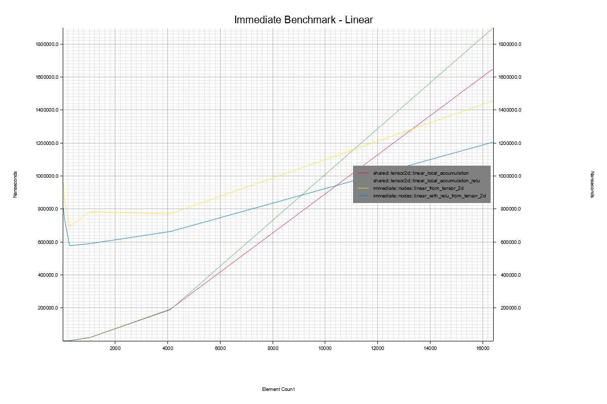
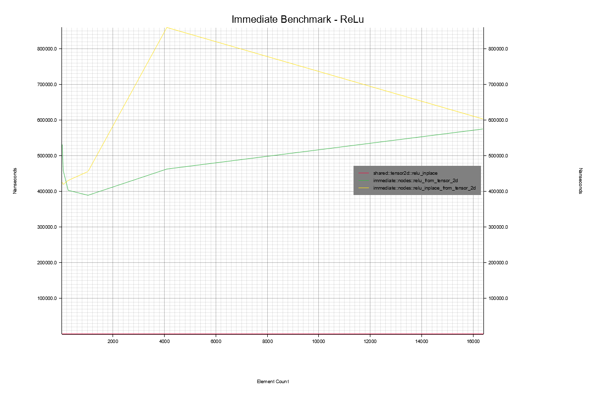
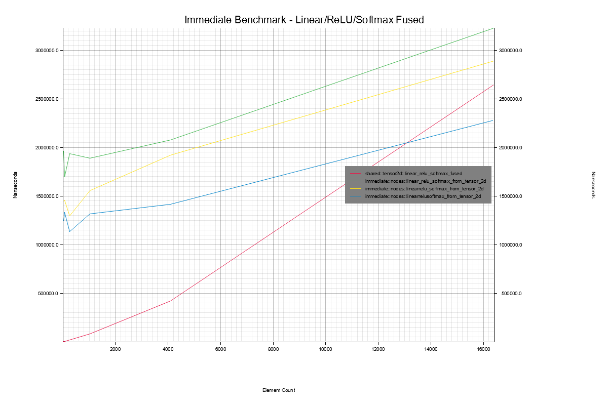

# 2️⃣ Immediate GPU computation
Now let's look at speeding up our operators with GPU, after this
we will take a look at building an actual computational graph, both
on the CPU and the GPU.

The first version of our GPU implementation, will be for immediate mode computation.
In this version the behavior will be treated a bit like executing a Python script.
Every command will be processed one at a time, no optimizations can be executed outside
of a single operation, and all data has to be ready for a new and completely different
operation to be executed afterwards. The result of this being that if the system
is told to execute a linear operator on some data, it will compile the code needed
to run on the GPU, allocate all necessary buffers on the GPU, transfer the needed data,
execute the operation, synchronize with the CPU and then transfer back all of the necessary
data to the CPU. If that linear operator is then followed by a ReLU operator, it will
have to do the whole thing over again. Compile the ReLU code for the GPU,
allocate buffers, transfer, execute, transfer back. Then possibly deallocate.

This is not a good way to accomplish this. But it is highly flexible and
we're gonna do it anyways! Don't worry about the 'how' too much, 3️⃣
goes into greater detail.

## Building the Linear Node
Okay, so let's try building the linear operator again, but this time on
the GPU! Don't worry too much about the particulars. The setup is quite
a bit like what is described in the 3️⃣ section of m1::s2.

There are three central files for this. ```src::shared::tensor2d_gpu.rs```,
```src::shared::shaders::linear.wgsl``` and ```src::immediate::nodes.rs```.
If you don't have them locally you can them [here][0], [here][1] and [here][2] respectively.

First of all, let's go directly to the shader (GPU) code in ```linear.wgsl```.
The version of the two functions we are interested in is ```main```.
At the top there is a struct called ```TensorDimensions```, it is
bound as something called a ```uniform```. The ```uniform``` is a struct,
it can also just be a single value, which is read only for the duration of our shader.
As such all threads can safely keep it entirely in their registers, or in whichever
cache they have room, without fear of the data getting stale. It also
means that each thread will be accessing the same data, and not just overlapping
data. But let's stay with the definition. We now have the ```group```, which is 0.
A binding group is a set of bindings. There are a limited amount of binding slots
available so you could have one set of buffers bound for group 0 and another set
of buffers bound for group 1. In the ```var``` declaration, you declare how the
bound data is used. Uniform is what I just wrote, you don't need to specify whether
it is ```read``` or ```read_write```, it is always just ```read```. For the more
general ```storage```, which is your normal buffer, you can specify
whether it is ```read``` or ```read_write```. Whether there is a performance impact
for one or the other might depend on your system, but the ```wgsl``` compiler is
likely to complain if you declare ```var<storage, read_write>``` without actually
writing to it. That's not just a performance thing, that is also good software
engineering. Don't give stuff more rights than it needs to. That allows
the compiler to give you helpful reminders that, at the very least writing
to this buffer wasn't your original declared intention.
We have several instances of ```array<f32>``` which is the raw data from our
```Tensor2D```s. You can reconstruct the entire ```Tensor2D``` by combining
this data with the dimension sizes from the ```TensorDimension``` struct.

So now we get to the code itself. For the matrix-matrix multiplication, the
dimensionality of the problem lends itself to a two dimensional solution.
So above the ```main``` function, which can be named anything by the way,
we define that our work group will have a size of 8 on the x-axis and
8 on the y-axis. This changes the way our threads individual ID's are
computed. Don't worry about it!

Then we define a number of built-in variables we would like to have
access too. There are more available than we declare here.
These are various ID's such as, what is this threads number inside
this work group, which work group is this thread in, out of all threads
which number thread is this thread, that sort of thing.
These are ```vec3<u32>``` because we actually dispatch our GPU programs
with three dimensional grids of threads. In the case where we only
use a single dimension, such as a sum reduction shader where we don't
care about dimensionality, we still launch it three dimensionally,
we just set the two last dimensions to one and then ignore them from
then on.

Next, the thread will calculate the correspondence between its global
ID and the element of the output matrix this specific thread will calculate.
Then we check whether these specific indices are outside the valid range
of indices, remember that we often launch more threads than we need.
Then we calculate the linearized index (multiple dimensions collapsed into one) in our one dimensional output array.
We declare and initialize a local variable to hold our running result,
which will hopefully ensure that we keep it in a register.
Then we just loop through the input row and weight column, multiplying
and adding, until we have accumulated our result, add our bias and then
store the result in the output tensor.

<figure markdown>
{ width="800" }
<figcaption>
Benchmarking Linear operator on the GPU and the CPU.
This benchmark was run on my laptop boasting an Intel i7-1185G7, 3.0 GHz with 32GB of RAM. The operating system was
Windows 10. The L1/L2/L3 caches were 320 KB, 5 MB and 12 MB respectively.
</figcaption>
</figure>

Given the immediate mode usage, we will always be paying for a full transfer
to and from the GPU. Clearly, the tensors will have to be quite large before
a single shot immediate linear operator starts paying off. Inexplicably,
the GPU version with ReLU is faster than without. This implementation of the
linear operator is quite suboptimal, it is left as an optional exercise to
implement a more optimal version using tiling and shared memory.

## Building ReLU
We then implement ReLU, Softmax and the fused operators in the same way.
ReLU you can just check out yourself in ```shaders::relu.wgsl``` or
[online][3] along with an inline implementation in ```shaders::relu_inline.wgsl``` or [here][4].

<figure markdown>
{ width="800" }
<figcaption>
Benchmarking ReLU operators on the GPU and CPU.
This benchmark was run on my laptop boasting an Intel i7-1185G7, 3.0 GHz with 32GB of RAM. The operating system was
Windows 10. The L1/L2/L3 caches were 320 KB, 5 MB and 12 MB respectively.
</figcaption>
</figure>

Interestingly, when done this way, the inline version is significantly slower than the normal, more functional,
version. As you can see with the redline, for ReLU, it will be quite some time before doing it on the GPU
is in any way faster.

## Building Softmax
Next up, we have the softmax operator. You will find the three shaders
needed for the softmax operator in ```shaders::softmax.wgsl``` or [online][5].

In this case, finding and communicating the maximum value and
the sum is a lot more complicated on a GPU. The implementation
provided is not even using all the possible threads, but just a
single work group to make the code more readable. Implementing
a tree reduction with iterative calls to max and sum shaders
is left as an exercise. So you don't need to know
what that is right now, just know that it is not just
implemented suboptimally, but even without more than 32 threads.
I did however cheat a little bit and use shared memory, to make it a bit faster.
Don't worry about shared memory, I will introduce it in 3️⃣.

<figure markdown>
{ width="800" }
<figcaption>
Benchmarking Softmax operators on the GPU and CPU.
This benchmark was run on my laptop boasting an Intel i7-1185G7, 3.0 GHz with 32GB of RAM. The operating system was
Windows 10. The L1/L2/L3 caches were 320 KB, 5 MB and 12 MB respectively.
</figcaption>
</figure>

Of course, the CPU implementation is faster, even if I had parallelized it correctly, it would have to quite
large to offset the cost of the transfer.

## Building Fused Operators
Finally, the fused operators are basically implemented through doing
a single transfer to and from, and calling the kernels and bindings
in succession. This is done CPU-side and there are no unique shaders
for them. Again, don't worry about the stuff happening CPU side.
Just know that it is implemented slighty suboptimally, and
these shaders aren't implemented optimally.

The only really interesting of the performance benchmarks, as I don't have many different implementations of
each operator is the fused ones.

<figure markdown>
{ width="800" }
<figcaption>
Benchmarking fused operators on the GPU. If there is no underscore between the operators they were fused.
This benchmark was run on my laptop boasting an Intel i7-1185G7, 3.0 GHz with 32GB of RAM. The operating system was
Windows 10. The L1/L2/L3 caches were 320 KB, 5 MB and 12 MB respectively.
</figcaption>
</figure>

As you can see, fusing all three operators and now having 2 transfers instead of 6 makes a big difference.
The fully fused operator wins by a large margin compared to the other GPU versions, but it still needs
quite a bit of scale before it can beat the CPU implementation. Now, let's start building some graphs!
_________________

## 3️⃣ Setting up to Dispatch Multiple Shaders
If you actually delve into how these immediate mode operators are implemented on the CPU side,
go to ```src::immediate::nodes.rs```. The code is almost the exact same as in the ```add_gpu```
example from ```m1::s2```, except now we will dispatch several shaders in a row, sharing
data. Especially the softmax and fused operators will be significantly different on the
CPU (host) side.

## 3️⃣ Caching Shaders
One other thing that is fundamentally suboptimal about this, is that we compile the shaders
for every operator, every time we use the operator. If you do lots of small matrix calls,
this will incur a significant overhead. Shader compilation is expensive. What you could do
instead is to cache your compiled shaders for reuse later on. This is done with the graph
implementations, but it has been left as an optional exercise for you to implement
this for immediate mode operations. This works just fine when you have 4-10 shaders to
compile and keep track of, but what if you had in the 1000's of combinations? In that
case you might need some form of cache eviction mechanism, such as LRU.

[0]: https://github.com/absorensen/the-guide/blob/main/m1_memory_hierarchies/code/computational_graphs/src/shared/tensor2d_gpu.rs
[1]: https://github.com/absorensen/the-guide/blob/main/m1_memory_hierarchies/code/computational_graphs/src/shared/shaders/linear_layer.wgsl
[2]: https://github.com/absorensen/the-guide/blob/main/m1_memory_hierarchies/code/computational_graphs/src/immediate/nodes.rs
[3]: https://github.com/absorensen/the-guide/blob/main/m1_memory_hierarchies/code/computational_graphs/src/shared/shaders/relu.wgsl
[4]: https://github.com/absorensen/the-guide/blob/main/m1_memory_hierarchies/code/computational_graphs/src/shared/shaders/relu_inline.wgsl
[5]: https://github.com/absorensen/the-guide/blob/main/m1_memory_hierarchies/code/computational_graphs/src/shared/shaders/softmax.wgsl
