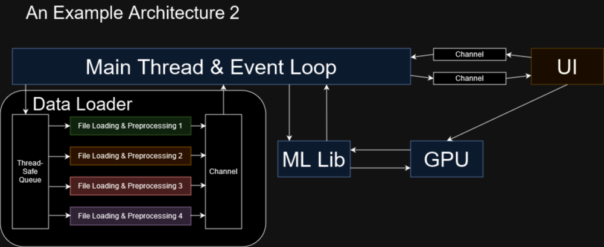

# Architecture and Design
I won't be introducing the entire field of software architecture in this section, but I'd like to throw a
few concepts your way to get you started. For some more design patterns you can check out [this book][0].
Hopefully, you'll see the idea entertaining those ideas and experiment with them yourself.
There should be plenty of material available on all of them. So anyways, minimizing statefulness,
components, and data-oriented design.

When constructing your systems you should try to minimize, if not completely elimitate global state.
By state I mean values which aren't the data that you operate on, but the values which change the way you handle
your data and the way it flows. You can't completely eliminate the need for state, but you can minimize the
consequences of it. Mitigate who can access it and who can write to it. One exception is defining some state
at the beginning of your program. If it is completely immutable after a setup phase it can easily be shared, but
we should still limit its exposure as to counteract the noise. A slightly less messy and dangerous construct
than global state is having state contexts. Think about a bundle of thematic state. Say we had 5 variables defining
how rendering was to be handled. We could bundle them into a context struct and then with the select few entities
where the context would be relevant we could give them a reference such as ```Arc<RenderContext>``` each. If the
render context was mutable we could give them each a ```Arc<Mutex<RenderContext>>``` to ensure synchronization.
Ideally, however, we could constrain this render context to a single entity, everything would be simpler and the
contention for the context would be lower. If we had a big context which suffered from lots of contention
we might be able to split it into a couple of smaller contexts to distribute contention. One concept that could
help us clearly formulate our code into parts which will hopefully limit any shared state. Shared state. Bad!
Anyways, let's talk about components.

An intuitive way to limit what state is shared and what isn't is to clearly define which parts of your
code is easily divisible into a single coherent entity. Define an interface. How do components interact with each
other? Which components have ownership of which data at which step in the pipeline? What needs to happen for a
component to be configured and ready to run? What is each components' relation to parallelism?
Do any of the components have side effects? Hint: Optimally, they shouldn't.
Having your code divvied up into components also allows several people to develop each component separately and
try out various implementations while keeping the functionality the same. This only really works if we mitigate the
side effects of each component. Mitigating statelessness, and certainly shared state, is also greatly helped
by formulating your code as components. If you really wanted to keep statelessness to the absolute minimum, you
could keep the state necessary to for each component to run it outside of the component and give it as an argument
to each function call. In my opinion, stress on opinion, this would be, in most cases, an example of a dogmatic
adherence to a principle. Just keep the necessary state inside the components. Still as little as possible, though.

Data-oriented design and branchless programming are important enough concepts that they have gotten their own
section which is the very next one. It basically boils down to this, instead of having an array of particles,
let's have a particle system which has arrays of each component in those particles, as it has to manipulate all
the particles anyway. Formulating your system as components is a good way to get started with this as you
can implement this new way of thinking about data under the hood without any changes in the interface. This
reformatting of your data can also be seen as a transposition of your data. Branchless programming seeks to
move the potential branches outside of loops and reduce potential branching for better performance. Doing this
is helped along by using data-oriented design, which was in turn helped along by encapsulation through components.

Entity component systems, is a system, most often used in games programming, wherein relevant data is composited
to do what seems to be a more flexible version of the classic first pass encapsulated data-oriented design. In
general it is something you most likely use a library to implement, like [Legion][3]. Alternatively, here's
a blog post about building [your own ECS][4].

## An Example Architecture
Let's take a look at an example architecture. This is an abstracted view of what a UI-based application, hooked up
to a machine learning library, using a GPU backend, with a multithreaded data loader might look like. 

<figure markdown>
{ width="800" }
<figcaption>
An example architecture of what a machine learning app might look like. The different colors denote
different threads.
</figcaption>
</figure>

As you can see we keep a main thread, orchestrating, moving data and launching other work. It takes commands through
a channel (communication mechanism) everytime something in the UI changes. The UI renders to screen using the GPU.
In turn the UI also gets messages through a channel from the main thread. It could for example be to show a new
image or change the status message. The main thread sends a list of data files to retrieve for each iteration
of a neural network training loop to a thread safe queue. Four threads dequeue the names of files to load. Each
of these threads load a file from the queue from disk and preprocesses the file if needed. Once the file is ready
they can enqueue the file in the output channel, which the main thread can dequeue from and send the data to the GPU
through a neural network library, like PyTorch or JAX.

Keep diagrams like these in mind when thinking about which components owns what data, which components are run
by which threads and so on. Where are your bottlenecks likely to be? Where is your hot loop?
Where could you distribute the work in a load balancing fashion?
Maybe the data loader should be a component which handles its own workload?

Encapsulation can also help us disentagle our components. We know the thread holding the thread safe queue and
administrating the loading and preprocessing threads only needs to worry about those parts, it's not doing
a bunch of global state manipulation or anything. It gets a list of commands and then iteratively gets new commands,
then it executes those things. We keep the extra threads inside that. This sort of encapsulation allows us to
keep our sanity while playing around with concurrency. The cognitive load is lowered as the scope and
consequences of changes are kept small. This of course also means that we have a smaller pocket of
parallelism bookended by communication in the thread safe queue and the channel. As such we have to make
sure the N threads doing loading and preprocessing have enough work. We should of course make sure that
the amount of work incoming is balanced with the amount of data getting dequeued from the output channel.

<figure markdown>
{ width="800" }
<figcaption>
Encapsulating the data loader, can make things simpler, and we can now at run time change out the data loader for
a different implementation.
</figcaption>
</figure>

All of these reasons about "what if, load balancing, thread this and thread that" are arguments why that component
should be encapsulated. You could try out preprocessing the entire dataset into one big file, or several big pages
and have the data loader administrate that entire process, or you could try increasing the load on the worker
threads through coroutines. You could even implement both and then switch between them based on which system your
application was running on. In any case, encapsulating your code into a data loader component might prohibit you
from some global optimizations, but making a move like that, which is in line with software engineering, which is
usually antithetical to optimal performance, in turn allows you to adapt to runtime circumstances, and more easily
lets you experiment with potential performance improvements.

[0]: https://gameprogrammingpatterns.com/
[1]: https://en.wikipedia.org/wiki/Data-oriented_design
[2]: https://en.wikipedia.org/wiki/Entity_component_system
[3]: https://github.com/amethyst/legion
[4]: https://ianjk.com/ecs-in-rust/
