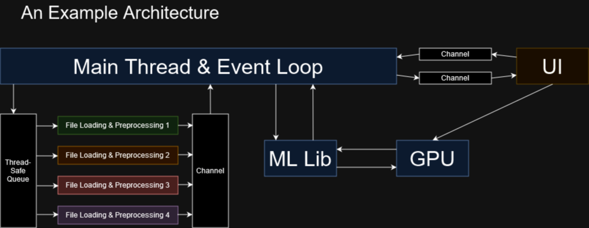

# Architecture and Design
Thinking in components
Who owns what data
Entity component systems -> Motivated by Branchless programming
Prefer stateless programming, minimize stateful programming (functional inspiration)

## An Example Architecture
<figure markdown>
{ width="800" }
<figcaption>
An example architecture of what a machine learning app might look like. The different colors denote
different threads.
</figcaption>
</figure>
Keep diagrams like these in mind when thinking about which components owns what data, which components are run
by which threads and so on
Where are your bottlenecks likely to be? Where is your hot loop?
Where could you distribute the work in a load balancing fashion?
Encapsulation, maybe the data loader should be a component which handles its own workload?
